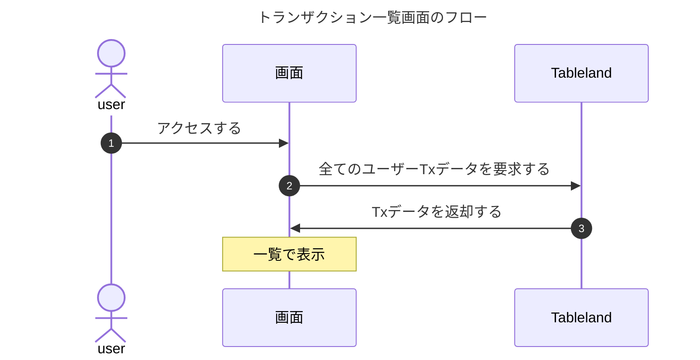
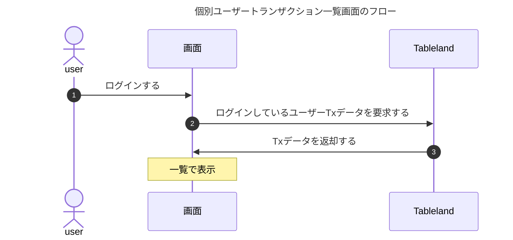
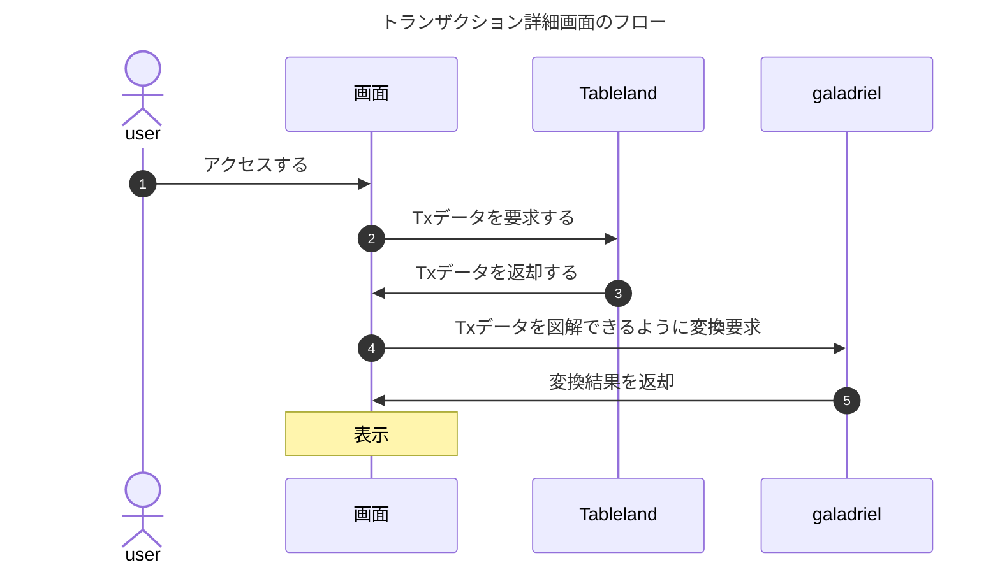
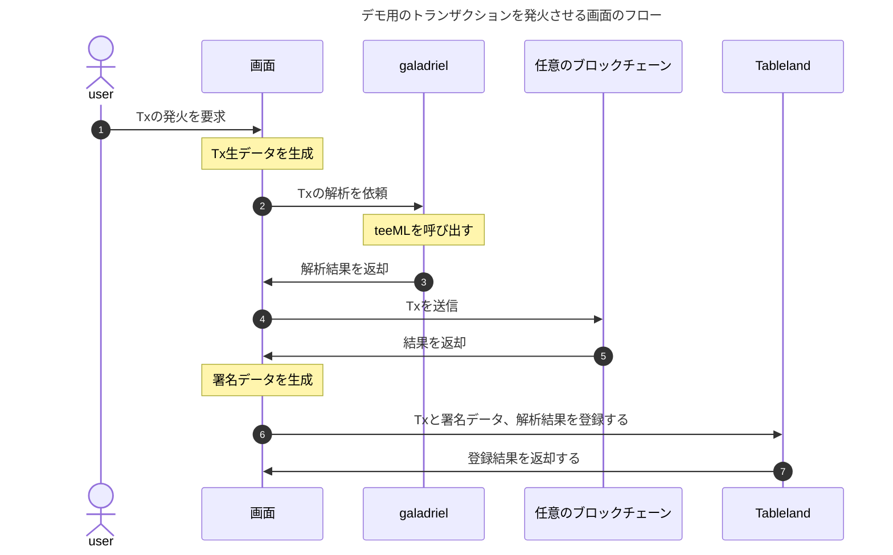

# シーケンス一覧

## トランザクション一覧画面

```mermaid
sequenceDiagram
    autonumber
    title: トランザクション一覧画面のフロー
    actor user
    participant front as 画面
    participant db as Tableland
    user ->> front: アクセスする
    front ->> db: 全てのユーザーTxデータを要求する
    db ->> front: Txデータを返却する
    Note over front: 一覧で表示
```

## (ログイン後)個別ユーザートランザクション一覧画面

```mermaid
sequenceDiagram
    autonumber
    title: 個別ユーザートランザクション一覧画面のフロー
    actor user
    participant front as 画面
    participant db as Tableland
    user ->> front: ログインする
    front ->> db: ログインしているユーザーTxデータを要求する
    db ->> front: Txデータを返却する
    Note over front: 一覧で表示
```

## トランザクション詳細画面

```mermaid
sequenceDiagram
    autonumber
    title: トランザクション詳細画面のフロー
    actor user
    participant front as 画面
    participant db as Tableland
    participant ai as galadriel
    user ->> front: アクセスする
    front ->> db: Txデータを要求する
    db ->> front: Txデータを返却する
    front ->> ai: Txデータを図解できるように変換要求
    ai ->> front: 変換結果を返却
    Note over front: 表示
```

## デモ用のトランザクションを発火させる画面

```mermaid
sequenceDiagram
    autonumber
    title: デモ用のトランザクションを発火させる画面のフロー
    actor user
    participant front as 画面
    participant ai as galadriel
    participant chain as 任意のブロックチェーン
    participant db as Tableland
    user ->> front: Txの発火を要求
    Note over front: Tx生データを生成
    front ->> ai: Txの解析を依頼
    Note over ai: teeMLを呼び出す
    ai ->> front: 解析結果を返却
    front ->> chain: Txを送信
    chain ->> front: 結果を返却
    Note over front: 署名データを生成
    front ->> db: Txと署名データ、解析結果を登録する
    db ->> front: 登録結果を返却する
```
